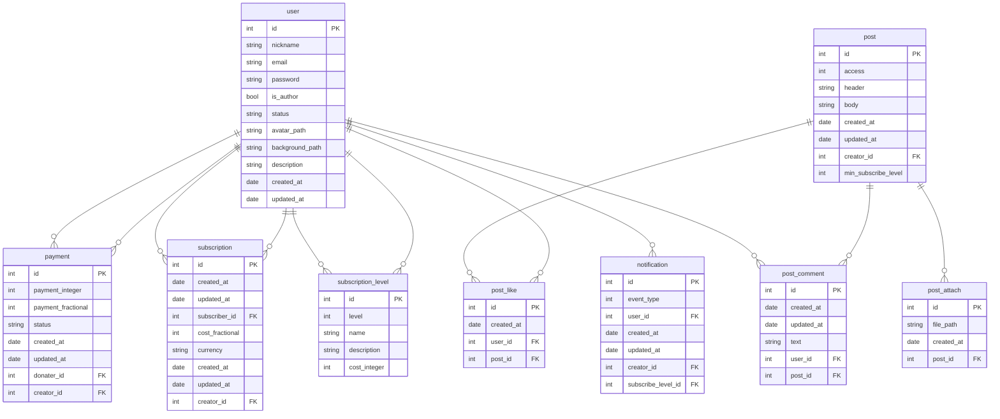

# Схема БД

## ER Диагрмма




### USER
Отношение `USER`. Содержит основную информацию о пользователе, его логин, захэшированный пароль, тип пользователя, пути до аватарки и фона
```
Relation USER:
  {id} -> nickname, password, is_author, status, avatar_path, background_path, description
  {email} -> nickname, password, is_author, status, avatar_path, background_path, description
```
В отношении `USER` выполняются следующие нормальные формы:

- **1 НФ** - поля id, email, nickname, password, is_author, status, avatar_path, background_path, description являются атомарными
- **2 НФ** - nickname, password, is_author, status, avatar_path, background_path, description функционально зависят полностью от первичного ключа id и потенциального ключа email
- **3 НФ** - среди неключевых атрибутов email, nickname, password, is_author, status, avatar_path, background_path, description нет функциональных зависимостей
- **НФБК** - все детерминанты являются потенциальными ключами

---

### PAYMENT

Отношение `PAYMENT`: Содержит информацию о платежах, кто задонатил, кому задонатил, сумма, статус платежа
```
Relation PAYMENT:
  {id} -> payment_type, payment_integer, payment_fractional, status, donater_id, creator_id, created_at, updated_at
```
В отношении `PAYMENT` выполняются следующие нормальные формы:

- **1 НФ** - поля id, payment_type, payment_integer, payment_fractional, status, donater_id, creator_id, created_at, updated_at являются атомарными
- **2 НФ** - payment_type, payment_integer, payment_fractional, status, donater_id, creator_id, created_at, updated_at функционально зависят полностью от первичного ключа id
- **3 НФ** - среди неключевых атрибутов payment_type, payment_integer, payment_fractional, status, donater_id, creator_id, created_at, updated_at нет функциональных зависимостей
- **НФБК** - все детерминанты являются потенциальными ключами

---

### SUBSCRIPTION

Таблица `SUBSCRIPTION`: Содержит информацию о подписках, кто на кого подписан с каким уровнем подписки
```
Relation SUBSCRIPTION:
  {id} -> creator_id, created_at, updated_at
  {subscriber_id, subscribe_level_id} -> creator_id, created_at, updated_at
```
В отношении `SUBSCRIPTION` выполняются следующие нормальные формы:

- **1 НФ** - поля id, subscriber_id, creator_id, subscribe_level_id, created_at, updated_at являются атомарными
- **2 НФ** - creator_id, created_at, updated_at функционально зависят полностью от первичного ключа id и потенциального ключа {subscriber_id, subscribe_level_id}
- **3 НФ** - среди неключевых атрибутов subscriber_id, subscribe_level_id, creator_id, created_at, updated_at нет функциональных зависимостей
- **НФБК** - все детерминанты являются потенциальными ключами

---

### SUBSCRIPTION_LEVEL

Таблица `SUBSCRIPTION_LEVEL`: Содержит информацию об уровнях подписки, какой уровень, название, стоимость, чья подписка
```
  {id} -> name, description, cost_integer, cost_fractional, currency, created_at, updated_at
  {creator_id, level} -> name, description, cost_integer, cost_fractional, currency, created_at, updated_at
```
В отношении `SUBSCRIPTION_LEVEL` выполняются следующие нормальные формы:

- **1 НФ** - поля id, creator_id, level, name, description, cost_integer, cost_fractional, currency, created_at, updated_at являются атомарными
- **2 НФ** - name, description, cost_integer, cost_fractional, currency, created_at, updated_at функционально зависят полностью от первичного ключа id и потенциального ключа {creator_id, level} 
- **3 НФ** - среди неключевых атрибутов creator_id, level, name, description, cost_integer, cost_fractional, currency, created_at, updated_at нет функциональных зависимостей
- **НФБК** - все детерминанты являются потенциальными ключами

---

### POST_LIKE

Таблица `POST_LIKE`: Содержит информацию о лайках
```
  {id} -> created_at, user_id, post_id
  {user_id, post_id} -> cretion_date
```

В отношении `POST_LIKE` выполняются следующие нормальные формы:

- **1 НФ** -  поля id, created_at, user_id, post_id являются атомарными
- **2 НФ** - cretion_date функционально зависят полностью от первичного ключа id и потенциального ключа {creator_id, level} 
- **3 НФ** - среди неключевых атрибутов user_id, post_id, cretion_date, updated_at нет функциональных зависимостей
- **НФБК** - все детерминанты являются потенциальными ключами

---

### POST_COMMENT
Таблица `POST_COMMENT`: Содержит информацию о комментариях
```
  {id} -> text, user_id, post_id, created_at, updated_at
```
В отношении `POST_COMMENT` выполняются следующие нормальные формы:

- **1 НФ** - id, text, user_id, post_id, created_at, updated_at являются атомарными
- **2 НФ** - text, user_id, post_id, created_at, updated_at функционально зависят полностью от первичного ключа id
- **3 НФ** - среди неключевых атрибутов text, user_id, post_id, created_at, updated_at нет функциональных зависимостей
- **НФБК** - все детерминанты являются потенциальными ключами

---

### POST
Таблица `POST`: Содержит информацию о постах, текстовое содержание поста, чей пост, минимальный уровень подписки для просмотра поста
```
  {id} -> access, header, body, creation_id, min_suscribe_level_id, created_at, updated_at
```
В отношении `POST` выполняются следующие нормальные формы:

- **1 НФ** - id, access, header, body, creation_id, min_suscribe_level_id, created_at, updated_at являются атомарными
- **2 НФ** - access, header, body, creation_id, min_suscribe_level_id, created_at, updated_at функционально зависят полностью от первичного ключа id
- **3 НФ** - среди неключевых атрибутов access, header, body, creation_id, min_suscribe_level_id, created_at, updated_at нет функциональных зависимостей
- **НФБК** - все детерминанты являются потенциальными ключами

---

### POST_ATTACH
Таблица `POST_ATTACH`: Содержит информацию о приложенных файлах к посту, путь до файла, какой пост
```
  {id} -> post_id, file_path, created_at
```
В отношении `POST_ATTACH` выполняются следующие нормальные формы:

- **1 НФ** - id, post_id, file_path, created_at являются атомарными
- **2 НФ** - post_id, file_path, created_at функционально зависят полностью от первичного ключа id
- **3 НФ** - среди неключевых атрибутов post_id, file_path, created_at нет функциональных зависимостей
- **НФБК** - все детерминанты являются потенциальными ключами

---

### NOTIFICATION
Таблица `NOTIFICATION`: Содержит информацию об уведовмлениях, тип уведомления, кому
```
  {id} -> event_type, user_id, created_at, updated_at
```
В отношении `NOTIFICATION` выполняются следующие нормальные формы:

- **1 НФ** - id, event_type, user_id являются атомарными
- **2 НФ** - event_type, user_id, created_at, updated_at функционально зависят полностью от первичного ключа id
- **3 НФ** - среди неключевых атрибутов event_type, user_id, created_at, updated_at нет функциональных зависимостей
- **НФБК** - все детерминанты являются потенциальными ключами

---